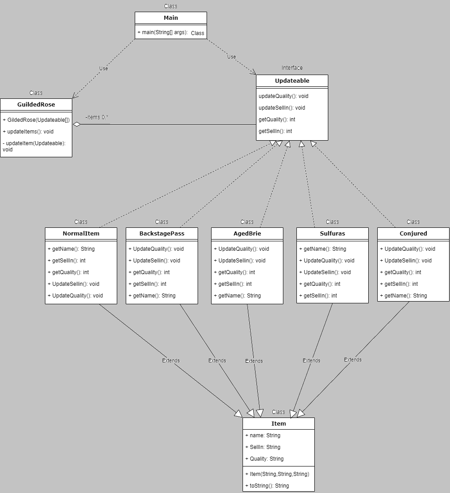

# GildedRose Kata

Proyecto Java de herencia.

## UML

## Acceso a datos

Implementamos en la rama DAO la capa de *services* y *resources* para no mezclar el proyecto principal de práctica de herencia con el añadido de acceso a datos.

**Coworker**: [Victor Sanchez](https://github.com/VoctorSN)
